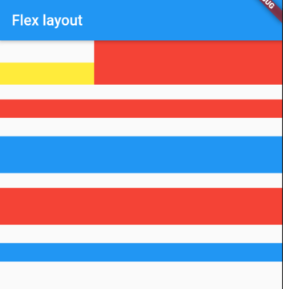

# Flex弹性布局

弹性布局运行子组件按照一定比列排列布局，类似Android中的LinearLayout等。Flex主要与Expanded配合来使用。

Row和Column继承自Flex，参数基本相同，所以使用Flex和使用Row或Column都可以进行替代使用。

```
Flex({
  ...
  @required this.direction, //弹性布局的方向, Row默认为水平方向，Column默认为垂直方向
  List<Widget> children = const <Widget>[],
})
```

## Expanded

可以在Flex、Row、Flex中使用Expanded来给其中的子组件按照比例进行排列。

```
const Expanded({
  int flex = 1, 
  @required Widget child,
})
```

flex为弹性系数，如果大于0，则Expanded会按照对应的比例系数进行排列，此时child中的height设置将没有意义。则如果为0或者null，则表示没有弹性，此时child中的height将会生效。

### Spacer

Spacer是Expanded的包装类，其功能仅仅是用来占用指定比列的控件。

```
import 'package:flutter/cupertino.dart';
import 'package:flutter/material.dart';


void main() => runApp(MyApp());

class MyApp extends StatelessWidget {
  // This widget is the root of your application.
  @override
  Widget build(BuildContext context) {
    return MaterialApp(
      title: 'Flutter Demo',
      theme: ThemeData(
        primarySwatch: Colors.blue,
      ),
      home: MyHomePage(),
    );
  }
}

class MyHomePage extends StatelessWidget {

  @override
  Widget build(BuildContext context) {
    return Scaffold(
      appBar: AppBar(
        title: Text("Flex layout"),
      ),
      body: Center(
        child: Column(
          children: <Widget>[
            Flex(
              crossAxisAlignment: CrossAxisAlignment.end,
              direction: Axis.horizontal,
              children: <Widget>[
                Expanded(
                  flex: 1,
                  child: Container(
                    height: 30,
                    color: Colors.yellow,
                  )),
                Expanded(
                    flex: 2,
                    child: Container(
                      height: 60,
                      color: Colors.red,
                    ))
              ],
            ),
            Padding(
              padding: const EdgeInsets.only(top: 20),
              child: SizedBox(
                height: 100,
                child: Flex(
                  direction: Axis.vertical,
                  children: <Widget>[
                    Expanded(
                      flex: 1,
                      child: Container(
                        color: Colors.red,
                      )),
                    Spacer(
                      flex: 1,
                    ),
                    Expanded(
                      flex: 2,
                      child: Container(
                        color: Colors.blue,
                      ))
                  ],
                ),
              ),
            ),
            Padding(
              padding: const EdgeInsets.only(top: 20),
              child: SizedBox(
                height: 100,
                child: Column(
                  children: <Widget>[
                    Expanded(
                      flex: 0,
                      child: Container(
                        height: 50,
                        color: Colors.red,
                      )
                    ),
                    Spacer(
                      flex: 1,
                    ),
                    Expanded(
                      child: Container(
                        color: Colors.blue,
                      )
                    )
                  ],
                ),
              ),
            )
          ],
        ),
      ),
    );
  }

}
```



