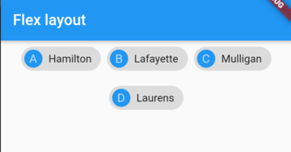
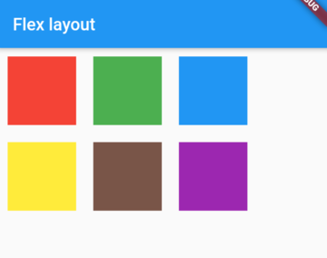

# 流式布局


对于Row或者Column而言，如果内容过多或过长，将会产生溢出异常。如

```
Row(
  mainAxisSize: MainAxisSize.max,
  mainAxisAlignment: MainAxisAlignment.center,
  children: <Widget>[
    Text("test" * 100)
  ],
)
```


因为Row默认只有一行，所以当子组件超过屏幕时将会溢出报错。Futter支持使用Wrap或Flow来支持自动折行，称此布局为流式布局。

## Wrap

Wrap可以通过设置对应的参数对子组件进行流式布局。

```
Wrap({
    Key key,
    this.direction = Axis.horizontal,
    this.alignment = WrapAlignment.start,
    this.spacing = 0.0,
    this.runAlignment = WrapAlignment.start,
    this.runSpacing = 0.0,
    this.crossAxisAlignment = WrapCrossAlignment.start,
    this.textDirection,
    this.verticalDirection = VerticalDirection.down,
    List<Widget> children = const <Widget>[],
  })
```

其中很多属性和之前布局的属性类似，可以认为除了Wrap可以折行之外，其余功能和Flex（Row或者Column）相同。它主要的起流式布局的作用的有以下几个属性：

- spacing：主轴方向上组件之间的间距
- runSpacing：纵轴方向上组件之间的间距
- runAlignment：纵轴方向组件的对齐方式

```
Wrap(
  spacing: 8.0, // 主轴(水平)方向间距
  runSpacing: 4.0, // 纵轴（垂直）方向间距
  alignment: WrapAlignment.center, //沿主轴方向居中
  children: <Widget>[
    new Chip(
      avatar: new CircleAvatar(backgroundColor: Colors.blue, child: Text('A')),
      label: new Text('Hamilton'),
    ),
    new Chip(
      avatar: new CircleAvatar(backgroundColor: Colors.blue, child: Text('M')),
      label: new Text('Lafayette'),
    ),
    new Chip(
      avatar: new CircleAvatar(backgroundColor: Colors.blue, child: Text('H')),
      label: new Text('Mulligan'),
    ),
    new Chip(
      avatar: new CircleAvatar(backgroundColor: Colors.blue, child: Text('J')),
      label: new Text('Laurens'),
    ),
  ],
)
```

运行效果如下：



## Flow

Flow可高度自定义子组件的布局，主要针对自定义布局策略或者高性能如动画的场景。Flow有以下优点：

- 性能好；Flow是一个对子组件尺寸以及位置调整非常高效的控件，Flow用转换矩阵在对子组件进行位置调整的时候进行了优化：在Flow定位过后，如果子组件的尺寸或者位置发生了变化，在FlowDelegate中的paintChildren()方法中调用context.paintChild 进行重绘，而context.paintChild在重绘时使用了转换矩阵，并*没有实际调整组件位置*。
- 灵活；由于我们需要自己实现FlowDelegate的paintChildren()方法，所以我们需要自己计算每一个组件的位置，因此，可以自定义布局策略。

> 不能自适应子组件大小，必须通过指定父容器大小或实现TestFlowDelegate的getSize返回固定大小。

```
class MyHomePage2 extends StatelessWidget {

  @override
  Widget build(BuildContext context) {
    return Scaffold(
      appBar: AppBar(
        title: Text("Flex layout"),
      ),
      body: Center(
        child: Flow(
          delegate: TestFlowDelegate(margin: EdgeInsets.all(10)),
          children: <Widget>[
            new Container(width: 80.0, height:80.0, color: Colors.red,),
            new Container(width: 80.0, height:80.0, color: Colors.green,),
            new Container(width: 80.0, height:80.0, color: Colors.blue,),
            new Container(width: 80.0, height:80.0,  color: Colors.yellow,),
            new Container(width: 80.0, height:80.0, color: Colors.brown,),
            new Container(width: 80.0, height:80.0,  color: Colors.purple,),
          ],
        ),
      ),
    );
  }

}


class TestFlowDelegate extends FlowDelegate {

  EdgeInsets margin = EdgeInsets.zero;

  TestFlowDelegate({this.margin});

  @override
  void paintChildren(FlowPaintingContext context) {
    var x = margin.left;
    var y = margin.top;
    //计算每一个子widget的位置
    for (int i = 0; i < context.childCount; i++) {
      var w = context.getChildSize(i).width + x + margin.right;
      if (w < context.size.width) {
        context.paintChild(i,
            transform: new Matrix4.translationValues(
                x, y, 0.0));
        x = w + margin.left;
      } else {
        x = margin.left;
        y += context.getChildSize(i).height + margin.top + margin.bottom;
        //绘制子widget(有优化)
        context.paintChild(i,
            transform: new Matrix4.translationValues(
                x, y, 0.0));
        x += context.getChildSize(i).width + margin.left + margin.right;
      }
    }
  }

/*

  @override
  Size getSize(BoxConstraints constraints) {
    return Size(double.infinity, 200);
  }
*/

  @override
  bool shouldRepaint(FlowDelegate oldDelegate) {
    return oldDelegate != this;
  }

}
```

运行效果：



[源码](code/flow.dart)